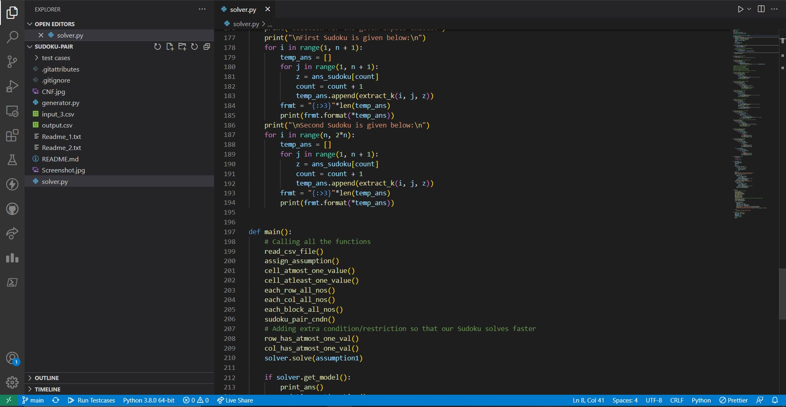
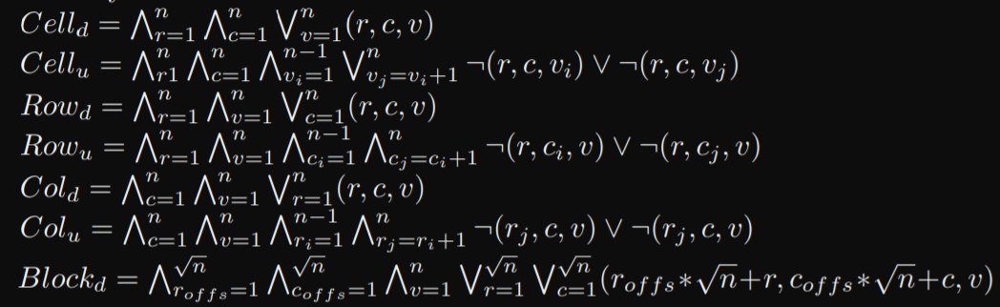

<div id="top"></div>


<!-- TABLE OF CONTENTS -->
<details>
  <summary>Table of Contents</summary>
  <ol>
    <li>  <a href="#about-the-project">About The Project</a>    </li>
    <li>  <a href="#algorithm">Algorithm</a>    </li>
    <li>
      <a href="#getting-started">Getting Started</a>
      <ul>
        <li><a href="#prerequisites">Prerequisites</a></li>
      </ul>
    </li>
    </ol>
</details>
<br>

 </img>

<!-- ABOUT THE PROJECT -->
## About The Project

I have created a Sudoku Pair Generator and Sudoku Pair Solver in Python using "pysat" library. Sudoku pairs are pair of sudokus which satisfies their independent constraints in addition to one more condition that the corresponding cell in both the sudoku should not be same.
* The Sudoku pair solver code is used to solve a sudoku pair simultaneously
* The Sudoku pair generator code is used to generate random sudoku pair simultaneously which have maximum number of holes as well as have only 1 unique solution.   

The Sudoku Pair solver and generator can be used to generate and solve sudoku pairs of any general dimension 'n'.  

Sudoku Pair Condition (for both sudokus):
* Each row and column must contain exactly n numbers from 1 to n.
* There should not be any repetition of any number in any row or column. 
* Each Block inside a nxn sudoku must contains exactly n numbers from 1 to n.

In addition to the above sudoku conditions, there is one more condition for sudoku Pairs.
* Corresponding cell of both sudokus must not contain same number.


## Algorithm
Sudoku Pair solver and generator is written in python programming language using pysat tool. Pysat is python library which is used to write CNF(Conjuctive normal Form) Clauses and solve these clauses using different Solver. 

Sudoku puzzle can be regarded as a propositional satisfiability (SAT) problem. A given puzzle can be formulated as a SAT formula which is satisfiable if andonly if the puzzle has a solution. Subsequently, the formula can be checked forsatisfiability using state-of-the-art SAT solvers. A formula in CNF is representedby a set of clauses. The standard input format for most SAT solvers is CNF.

The SAT Condition in mathematical form can be represented as follows:

 </img>
These condition are then converted into clauses using a suitable encoding system and then the clauses are solved to get the final model for the SAT problem using proper assumption list as an arguments. The final model is then converted into a proper deleiverable ouptut as a sudoku pairs.

<!-- GETTING STARTED -->
## Getting Started

To use the sudoku pair solver programme, simply write the following command in your code editor terminal 
* npm
  ```sh
    py solver.py
  ```
  The programm will automatically solve the input sudoku and generate the final sudoku in the terminal. If you want to change the input sudoku, simply open the input csv file present in the "Test cases" folder and change the inputs. 

To use the sudoku pair generator programme, simply write the following command in your code editor terminal 
* npm
  ```sh
    py generator.py
  ```
  The programm will automatically generate unsolved sudoku pair. It will automatically print the output in the "output.csv" file and you can also print the output in the terminal as well.
   

### Prerequisites

The only prerequisites for running the code is to have python3 installed in your system along with the pysat library. 
To install pysat library, simply follow the below command :
* npm
  ```sh
  pip install python-sat[pblib,aiger]
  ```
If the system throws any erro i would recommend you to follow the installation guide [here](https://pysathq.github.io/installation.html#installation)

### Colaborators
1. Vartika
2. Deepak
### THANK YOU
